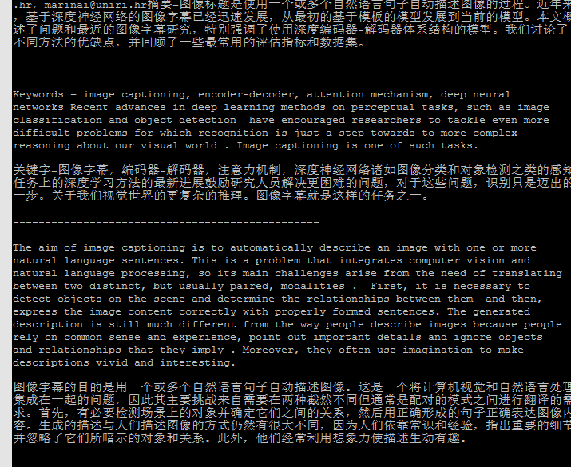

### 这是一个将英文pdf自动翻译为中文的脚本。使用了三个库：`fitz`库打开pdf文件，使用`re`库处理文本，使用`googletrans`库进行翻译。

这项工作的起因是因为一项作业要求写3000字的中文综述，将英文文献全文翻译可以大大缩短任务时间。

本工作首先参考了QPromise的[EasyTrans](https://github.com/QPromise/EasyTrans)项目，该项目将pdf转为排版后的word文档，您可移步该网址了解更多内容。

没有使用Qpromise项目的原因在于
+ 在我的测试中，该代码对于不同pdf文档的兼容性不强，有很多无法翻译的情况（我使用的是带有图片的双栏pdf）
+ 该项目较为庞大，依赖包较多。而我仅仅需要一个精简和高效的脚本即可
+ 其使用的翻译借口为request，但是我测试发现该方法不如直接安装谷歌翻译的`googletrans`包来得精确。
+ 希望尽可能保持段落不被分隔

### 如何运行本项目
```
cd ...  # 您可自定义路径，默认将脚本和文件放在同一目录下
python pdf_en2chn.py
```

### 脚本是如何工作的

1. 对于文本逐行扫描
2. 若该行以句号结尾，且下一行第一个字符为大写字母，判定为段落之间的分隔；否则段落未结束，继续扫描
3. 异常的处理：
	+ 换页： 在实际的论文中，要么换页时该段结束，要么到下一页开始，因此检测最后一行是否为句号即可
	+ 换行符的处理： 每行都替换为空
	+ 分词的处理：如Image单词在某一行间被分隔为Im-\n age，则使用正则表达式判断：`-`在末尾则将其删除（会误判一些词，如`encoder-decoder`，但影响不大）
	+ 参考文献的处理：带有`[1]`形式的文本谷歌翻译效果较差，于是将其删除（也可替换为某一特定字符，如‘literature’）
	+ 章节标志处理：形如`II. INTRODUCTIN`的情况，可以通过判断每一行里大写多还是小写多将其区分开来
4. 接入谷歌翻译接口，打印到本地文件

	
### 效果



